# 20232BSET03P2
Inteli - Engenharia de Software | Avaliação 2023-2B P2

# Prova Prática

Lívia Mattoso Bonotto Cabral

### ENDPOINTS CATS

Registrando Gato:

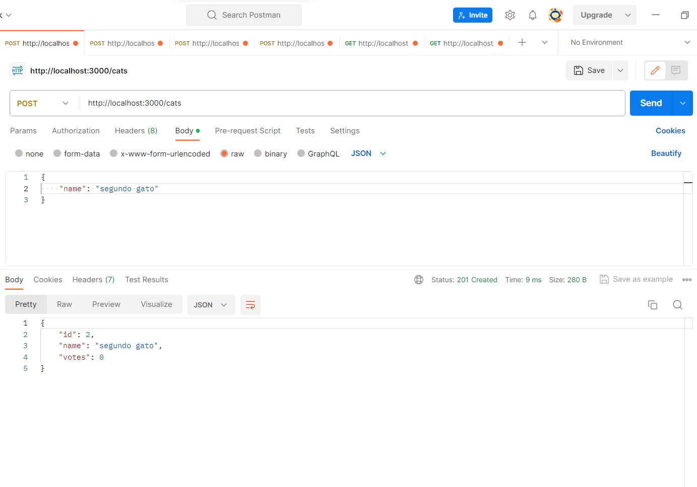

Inserindo um nome de gato inválido:

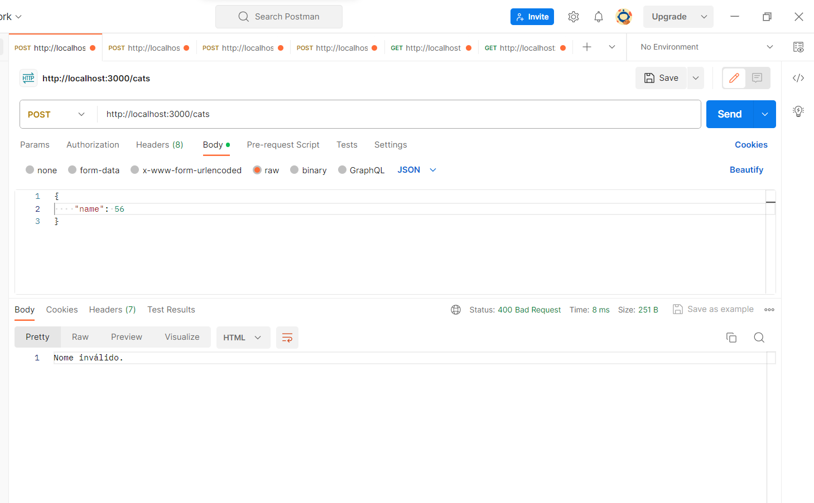

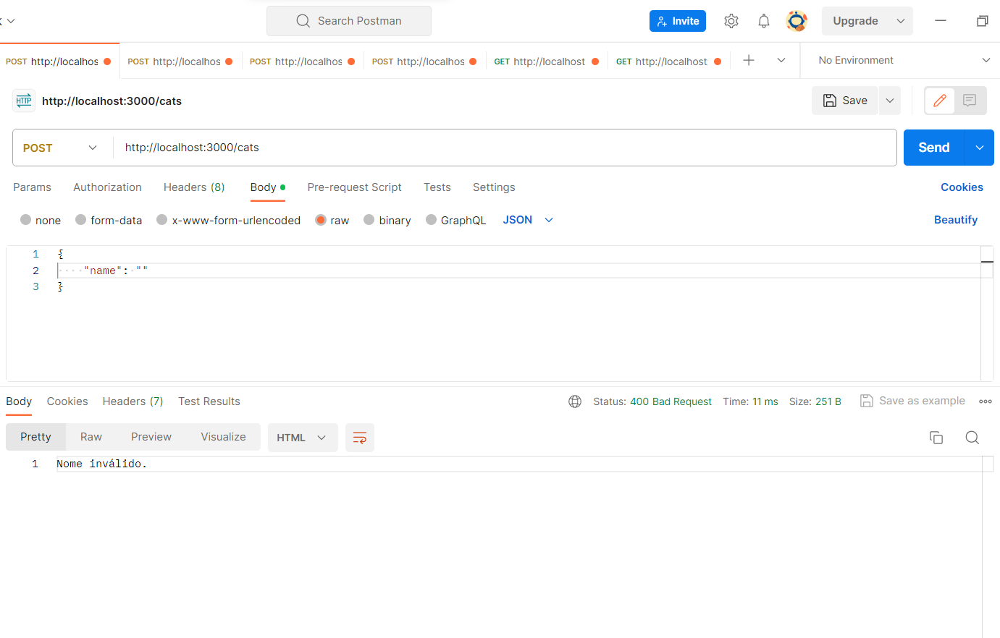

Gatos registrados:

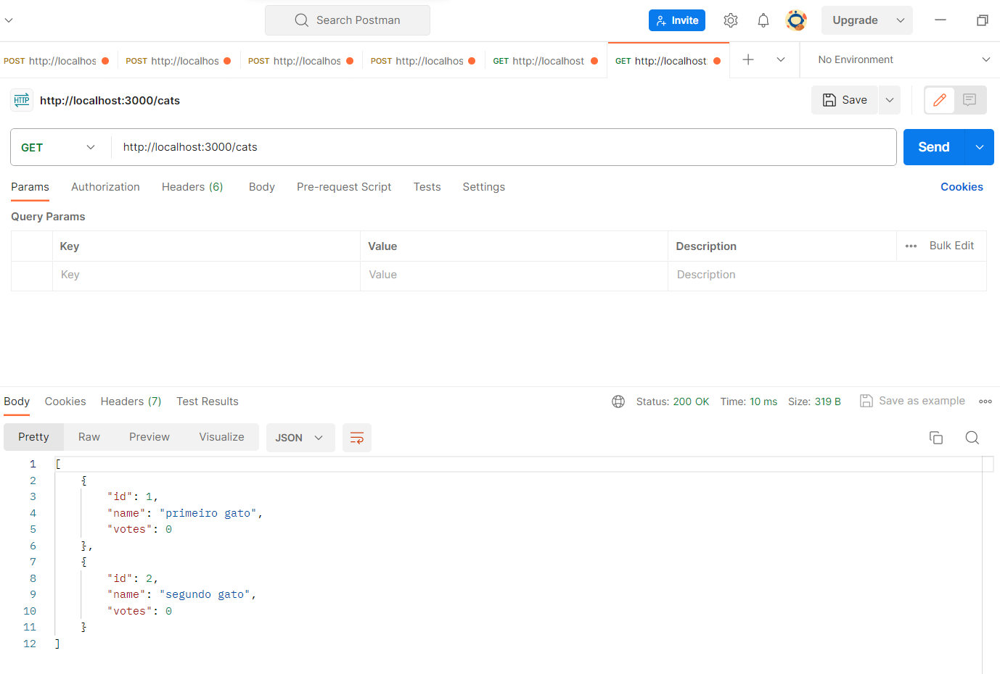

Votando em um gato:

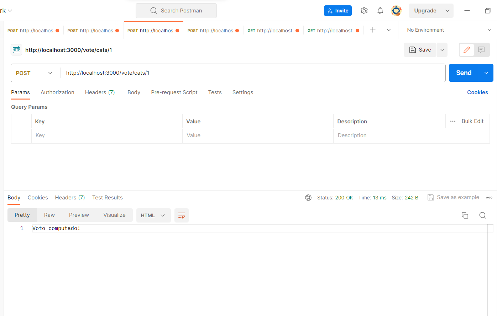

Votando em um gato não registrado: 

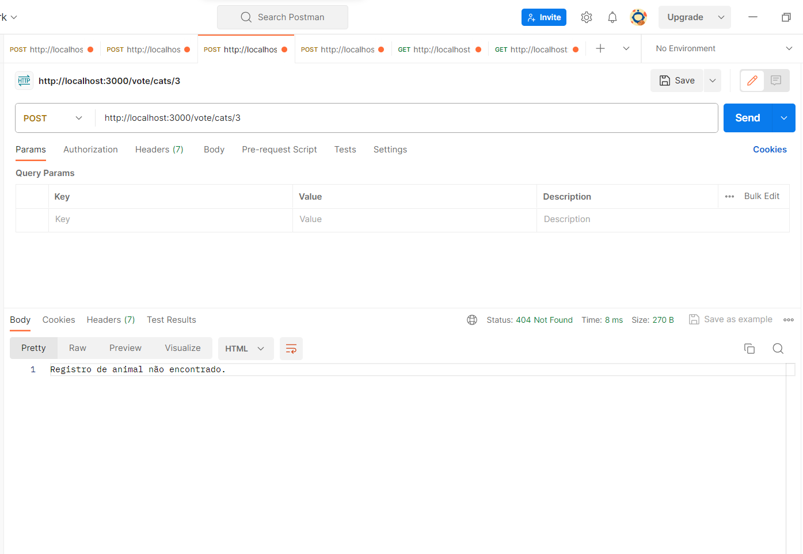

Pegando registro de cats e votos:

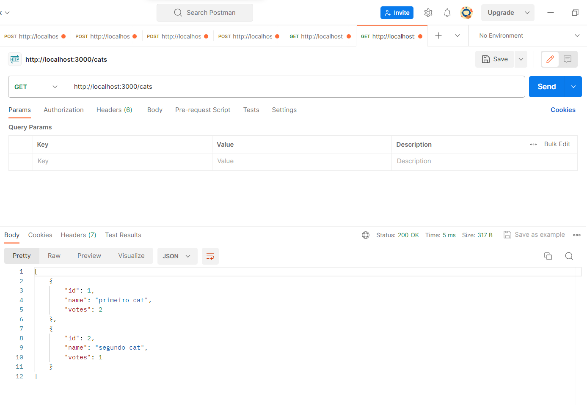

### ENDPOINTS DOGS

Registrando Cachorro:

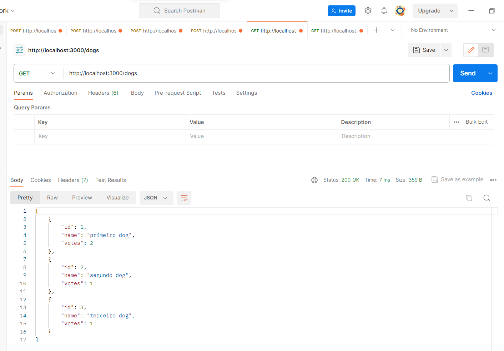

Inserindo um nome de cachorro inválido:

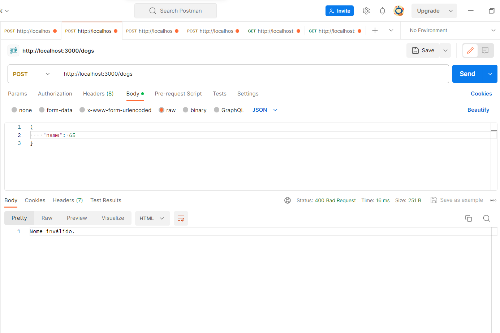

Cachorros registrados: 

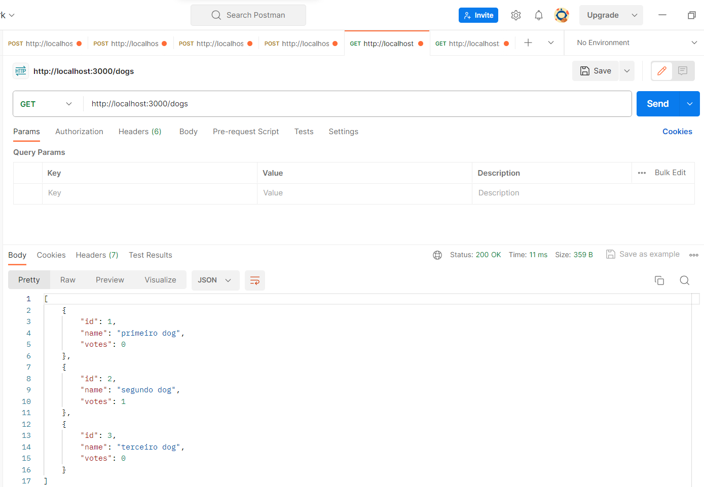

Votando em um cachorro:

Votando em um cachorro não registrado: 

Pegando registro de dogs e votos:

### Votando em outro animal (inválido):

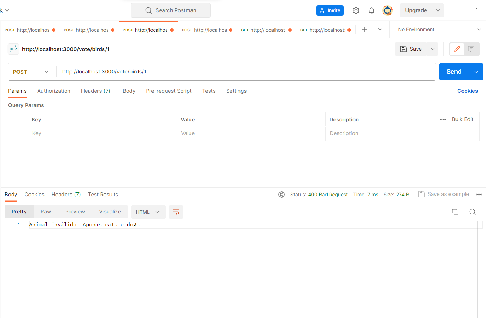

### Vulnerabilidades e medidas adotadas

- **SQL Injection**: resolvido usando prepared statements;
- **Validação de entrada**: adicionada validação para tipos de dados e verificação de campos obrigatórios;
- **Verificação de existência de registro**: implementada a verificação antes de adicionar votos;
- **Tratamento de erros**: verificado para evitar vazamento de informações.
